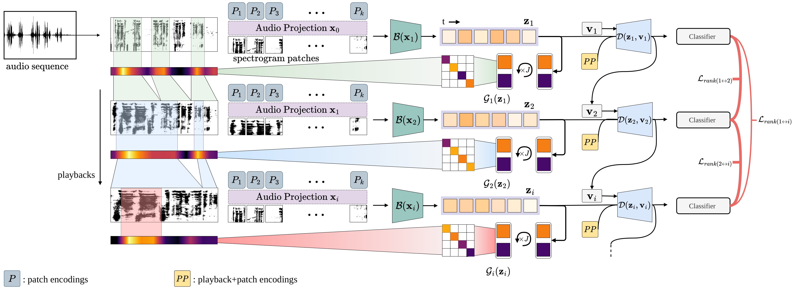

# Play It Back: Iterative Attention for Audio Recognition

- <a href="https://alexandrosstergiou.github.io/project_pages/PlayItBack/index.html">[Project page]</a>

- <a href="#">[ArXiv paper]</a>


## Abstract
A key function of auditory cognition is the association of characteristic sounds with their corresponding semantics over time.
Humans attempting to discriminate between fine-grained audio categories, often replay the same discriminative sounds to increase their prediction confidence.
We propose an end-to-end attention-based architecture that through selective repetition attends over the most discriminative sounds across the audio sequence. Our model initially uses the full audio sequence and iteratively refines the temporal segments replayed based on slot attention. At each playback, the selected segments are replayed using a smaller hop length which represents higher resolution features within these segments. 
We show that our method can consistently achieve state-of-the-art performance across three audio-classification benchmarks: AudioSet, VGG-Sound, and EPIC-KITCHENS-100. 

<p align="center">

</p>


## Dependencies
Ensure that the following packages are installed in your machine:

  * [PyTorch](https://pytorch.org) 
  * [librosa](https://librosa.org)
  * [h5py](https://www.h5py.org)
  * [wandb](https://wandb.ai/site)
  * [fvcore](https://github.com/facebookresearch/fvcore/)
  * [simplejson](https://pypi.org/project/simplejson/)
  * [psutil](https://pypi.org/project/psutil/)
  * [tensorboard](https://www.tensorflow.org/tensorboard/) 

Single-line install with pip:
```
pip install torch torchvision torchaudio librosa h5py wandb fvcore simplejson psutil tensorboard
```

! Note that different from [PySlowFast](https://github.com/facebookresearch/SlowFast), __there is no need__ to add the repo to your Add this repository to `$PYTHONPATH`.

## Datasets

### Downloading

- __AudioSet__: The following [fork](https://github.com/alexandrosstergiou/audioset-processing) of [audioset-processing](https://github.com/aoifemcdonagh/audioset-processing) was used to download the full dataset while also using multiple processes to download individual video files. The original repository only uses a main process which makes dataset crawling very slow.

  Depending on the availability of videos, the `train` and `test` files should be adjusted as the current repo does not re-sample files that do not exist.

- __VGG-Sound__: Apart from [the repository](https://github.com/speedyseal/audiosetdl) used to download the dataset and that is referenced by the [VGGSound](https://github.com/hche11/VGGSound), an alternative way for acquiring the dataset is to use the script from [this issue](https://github.com/hche11/VGGSound/issues/2).

- __EPIC-KITCHENS-100__: You can follow the same steps as in [Auditory SlowFast](https://github.com/ekazakos/auditory-slow-fast) for downloading and generating the dataset in `.hdf5` format.

### File formats

Audio files for the datasets are expected in the following formats:
- __AudioSet__ -> `.flac` (can be changed by editing [Line 42 @ datasets/audioloader_audioset.py](https://github.com/alexandrosstergiou/PlayItBack/blob/336cd4037a32236a6d80e27b07ee26335df95f06/playitback/datasets/audio_loader_audioset.py#L42))

- __VGG-Sound__ -> `.wav` (can be changed by editing [Line 41 @ datasets_audioloader_vggsound.py](https://github.com/alexandrosstergiou/PlayItBack/blob/336cd4037a32236a6d80e27b07ee26335df95f06/playitback/datasets/audio_loader_vggsound.py#L41))

- __EPIC-KITCHENS-100__ -> A single `.hdf5` file containing the entire dataset (see [Auditory SlowFast](https://github.com/ekazakos/auditory-slow-fast) for more info about creating the file).


## Usage

### Training/Evaluating

For training and testing you can run `python tools/run_net.py` with the following arguments depending on the dataset:

- __AudioSet__

  - `--cfg` : The model configuration file to be used from `configs/AudioSet`.

  - `AUDIOSET.AUDIO_DATA_DIR` : The directory containing all AudioSet audio files.

  - `AUDIOSET.ANNOTATIONS_DIR` : The directory of the `train`
 and `test` splits in `.pkl` format. They can be found in `data/AudioSet`.

- __VGG-Sound__

  - `--cfg` : The model configuration file to be used from `configs/VGG-Sound`.

  - `VGGSOUND.AUDIO_DATA_DIR` : The directory containing all VGG-Sound audio files.

  - `VGGSOUND.ANNOTATIONS_DIR` : The directory of the `train`
 and `test` splits in `.pkl` format. They can be found in `data/VGG-Sound`.


- __EPIC-KITCHENS-100__

  - `--cfg` : The model configuration file to be used from `configs/EPIC-KITCHENS`.

  - `EPICKITCHENS.AUDIO_DATA_FILE` : The directory containing the EPIC-KITCHENS data file.
  
  - `EPICKITCHENS.ANNOTATIONS_DIR` : The directory of the `train`
 and `test` splits in `.pkl` format. They can be found in `data/EPIC-KITCHENS`.

The following (usefully notable) arguments can also be used regardless of the dataset:

- `NUM_GPUS` : Explicitly defining the number of GPUs to be used.

- `OUTPUT_DIR` : The directory for checkpoints and runs to be saved in.

- `TRAIN.CHECKPOINT_FILE_PATH` : The filepath of a checkpoint (either just the encoder or both the encoder+decoder) used to initialize the model during the start of training.

#### (Evaluation only)

- `TRAIN.ENABLE` : Should be set to `False`. 

- `TEST.ENABLE` : Should be set to `True`. 

- `TEST.CHECKPOINT_FILE_PATH` : The filepath of a checkpoint (either just the encoder or both the encoder+decoder) used to load the model during evaluation.


## Acknowledgement

This repository is an adjustment of [auditory-slow-fast](https://github.com/ekazakos/auditory-slow-fast) and [PySlowFast](https://github.com/facebookresearch/SlowFast) that also includes batch-wise playbacks.


## Citation


```
@article{stergiou2022playitback,
title={Play It Back: Iterative Attention for Audio Recognition},
author={Stergiou, Alexandros and Damen, Dima},
journal={arXiv preprint},
year={2022}}
```

## License

Apache 2.0
